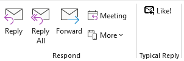
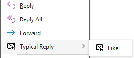
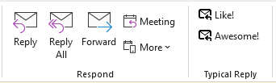

# typical-reply-outlook

## Overview

Provides ability to send/receive typical replies in a team.

For example, if you are reading a mail like:

```
Subject:
  How about this?

Body:
  Hi.
  I've wrote a plan. How about this?
  http://...
```

Then you can send a typical reply quickly by following one of the steps below. 

* Click the "Like!" button in the ribbon.
  
* Click the "Like!" buton from the context menu on a mail item.
  

```
Subject:
  [[Like!]]: Re: How about this?

Body:
  Like!
  
  > Hi.
  > I've wrote a plan. How about this?
  > http://...
```

These reply content configurations can be centrally managed on a domain-by-domain basis via group policy.
Configurations can also be changed for each user using individual configuration files.

## Configuration via group policy

Move admx and adml files under the policy folder into following one of the paths below.

* When adding Active Directory group policy
  * `C:\Windows\SYSVOL\domain\Policies\PolicyDefinitions`
* When adding local group policy
  * `C:\Windows\PolicyDefinitions`

Open Group Policy Editor and open Administrative Templates -> TypicalReply -> Defaults -> TypicalReply Settings.
Enable this configuration and enter the JSON configuration described below in the text area.

## Configuration via configuration file

The configuration file is located in the following path.

`%APPDATA%\TypicalReply\TypicalReplyConfig.json`

We need specify the configuration with JSON described below to this configuration file.

If the group policy configuration and configuration file configuration have different priorities, the configuration with higher priority is used.
If the priorities are the same, the configurations are merged with the group policy content and the configuration file content.

* GroupLabel is used from the configuration file if it is specified.
* ButtonConfigList is merged the contents of group policy and configuration file
  * If there is a duplicate ID, the one in the configuration file will be used

## Installing default configuration files with the installer

By running the setup with `DefaultConfig\TypicalReplyConfig.json` placed in the folder where the setup exists, 
the file will be automatically placed in `%APPDATA%\TypicalReply\TypicalReplyConfig.json`.

## Configuration items

Specify the settings in JSON format as below.

```
{
    "Priority" : 1,
    "ConfigList": [
        {
            "Culture": "ja-JP",
            "GroupLabel": "Like!",
            "ButtonConfigList": [
                {
                    "Id": "Like",
                    "Label": "いいね！",
                    "SubjectPrefix": "[[いいね！]]:",
                    "Body": "いいね！",
                    "Recipients": ["all"],
                    "QuoteType": true,
                    "AllowedDomains": [
                        "*"
                    ]
                },
                {
                    "Id": "OK",
                    "Label": "了解",
                    "SubjectPrefix": "[[了解]]:",
                    "Body": "了解しました。",
                    "Recipients": ["all"],
                    "QuoteType": true,
                    "AllowedDomains": [
                        "*"
                    ]
                }
            ]
        },
        {
            "Culture": "en-US",
            "GroupLabel": "Typical Reply",
            "ButtonConfigList": [
                {
                    "Id": "Like",
                    "Label": "Like!",
                    "SubjectPrefix": "[[Like!]]:",
                    "Body": "Like!",
                    "Recipients": ["all"],
                    "QuoteType": true,
                    "AllowedDomains": [
                        "*"
                    ]
                },
                {
                    "Id": "OK",
                    "Label": "OK",
                    "SubjectPrefix": "[[OK]]:",
                    "Body": "OK.",
                    "Recipients": ["all"],
                    "QuoteType": true,
                    "AllowedDomains": [
                        "*"
                    ]
                }
            ]
        }
    ]
}
```

TypiclReplyConfig: Root of configuration

| Setting name | Type           | Required | Default when omitted | Summary                                                                                                                                                                                              |
| ------------ | -------------- | -------- | -------------------- | ---------------------------------------------------------------------------------------------------------------------------------------------------------------------------------------------------- |
| Priority     | Integer        | no       | -1                   | The priority of using configulations in the registry or configuration files. <br>The configuration has larger priority is used. <br>If the values ​​are the same, the configurations will be merged. |
| ConfigList   | List of Config | yes      | -                    | List of Configs for each language                                                                                                                                                                    |


Config: configuration for each language

| Setting name     | Type                 | Required | Default when omitted | Summary                                                                                                                                                                                                          | Examples          |
| ---------------- | -------------------- | -------- | -------------------- | ---------------------------------------------------------------------------------------------------------------------------------------------------------------------------------------------------------------- | ----------------- |
| Culture          | String               | no       | null                 | Target culture. <br>It is also possible to specify only the language without locale. <br>If there is no Culture that matches the current culture, the first Config will be used regardless of the Culture value. | `"en-US"`、`"en"` |
| GroupLabel       | String               | no       | "Typical Reply"      | Label of this function displayed on the ribbon or context menu                                                                                                                                                   | `"Typical Reply"` |
| ButtonConfigList | List of ButtonConfig | yes      | -                    | List of typical reply button configurations                                                                                                                                                                      | -                 |

ButtonConfig: Typical reply button configurations. Configure reply content and reply destination and so on.

| Setting name   | Type           | Required | Default when omitted  | Summary                                                                                                                                                                                                              | Examples                                  |
| -------------- | -------------- | -------- | --------------------- | -------------------------------------------------------------------------------------------------------------------------------------------------------------------------------------------------------------------- | ----------------------------------------- |
| Id             | String         | yes      | -                     | ID of the button. Cannot be duplicated in ButtonConfigList.                                                                                                                                                          | `"LikeId"`                                |
| Label          | String         | yes      | -                     | Label displayed on button                                                                                                                                                                                            | `"Like!"`                                 |
| SubjectPrefix  | String         | no       | null                  | Text to be inserted at the beginning of the subject                                                                                                                                                                  | `"[[Like!]]"`                             |
| Subject        | String         | no       | Default reply subject | Subject                                                                                                                                                                                                              | `"Report"`                                |
| Body           | String         | no       | null                  | Body                                                                                                                                                                                                                 | `"Like!"`                                 |
| Recipients     | List of String | no       | No recipients         | Mail recipients. <br>`["blank"]`: No recipients<br> `["all"]`: Reply to all<br>`["sender"]`: Reply only to sender<br>Other String List: Reply to specified addresses                                                 | `["test@test.co.jp", "test2@test.co.jp"]` |
| QuoteType      | Boolean        | no       | false                 | Whether to quote the original text. <br> `true`: Quote<br>`false`: Do not quote                                                                                                                                      | `true`                                    |
| AllowedDomains | List of String | no       | Allow all             | List of domains allowed to send. If a domain other than this domain list is included, the reply email will not be created or sent. <br>`["*"]`: Allow all<br>Other String list: Allow only specified domains to send | `["test.co.jp", "test2.co.jp"]`           |
| ForwardType    | String         | no       | Do not attach         | Whether to attach the original email. <br>`attachment`: attach                                                                                                                                                       | `attachment`                              |
| Size           | String         | no       | "normal"              | Size of buttons displayed in the group.<br>`normal`: Normal button<br>`large`: Large button                                                                                                                          | `"attachment"`                            |

## Example of adding new settings

Think of a way to add a button that says "Awesome!"

Edit the configuration file (`%APPDATA%\TypicalReply\TypicalReplyConfig.json`).

Suppose your current settings are as follows:

```
{
    "ConfigList": [
        {
            "Culture": "en-US",
            "GroupLabel": "Typical Reply",
            "ButtonConfigList": [
                {
                    "Id": "Like",
                    "Label": "Like!",
                    "SubjectPrefix": "[[Like!]]:",
                    "Body": "Like!",
                    "Recipients": ["all"],
                    "QuoteType": true,
                    "AllowedDomains": [
                        "*"
                    ]
                }
            ]
        }
    ]
}
```

Add ButtonConfig to ButtonConfigList.

Set `Id` to `Awesome` and `Label` to `Awesome! `.

```
{
    "Id": "Awesome",
    "Label": "Awesome!"
}
```

Since you are replying to the original message, leave the original subject and add a reaction message to the subject.
To do this, leave `Subject` empty so that the original subject remains, and use `SubjectPrefix` to prepend the message to the subject.

```
{
    "Id": "Awesome",
    "Label": "Awesome!",
    "SubjectPrefix": "[[Awesome!]]:"
}
```

Similarly, since you are replying to the original message, leave the original text (quote it) and add the message to the text.
To do this, specify a message in `Body` and `true` in `QuoteType`.

```
{
    "Id": "Awesome",
    "Label": "Awesome!",
    "SubjectPrefix": "[[Awesome!]]:",
    "Body": "Awesome!",
    "QuoteType": true
}
```

This button will only reply to the sender.
To do this, specify `["sender"]` in `Recipients`.

```
{
    "Id": "Awesome",
    "Label": "Awesome!",
    "SubjectPrefix": "[[Awesome!]]:",
    "Body": "Awesome!",
    "QuoteType": true
    "Recipients": ["sender"]
}
```

Also, the destination domain will be limited to `test.co.jp` to which you belong.
To do this, specify `["all"]` for `AllowedDomains`.

```
{
    "Id": "Awesome",
    "Label": "Awesome!",
    "SubjectPrefix": "[[Awesome!]]:",
    "Body": "Awesome!",
    "QuoteType": true
    "Recipients": ["sender"]
    "AllowedDomains": ["test.co.jp"]
}
```

Attaching the original message is not required.
Therefore, `ForwardType` is not specified.

Add the config created above to ButtonConfigList.

```
{
    "ConfigList": [
        {
            "Culture": "en-US",
            "GroupLabel": "Typical Reply",
            "ButtonConfigList": [
                {
                    "Id": "Like",
                    "Label": "Like!",
                    "SubjectPrefix": "[[Like!]]:",
                    "Body": "Like!",
                    "Recipients": ["all"],
                    "QuoteType": true,
                    "AllowedDomains": [
                        "*"
                    ]
                },
                {
                    "Id": "Awesome",
                    "Label": "Awesome!",
                    "SubjectPrefix": "[[Awesome!]]:",
                    "Body": "Awesome!",
                    "QuoteType": true
                    "Recipients": ["sender"]
                    "AllowedDomains": ["test.co.jp"]
                }
            ]
        }
    ]
}
```

The "Awesome!" button will now be added to the typical reply buttons.


